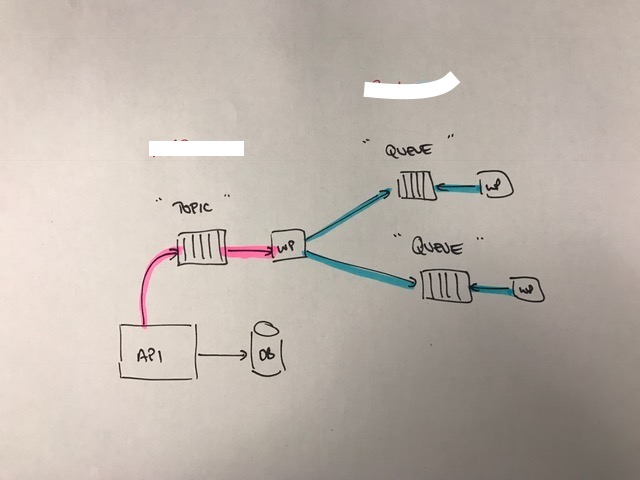

# Redis Topic -> Queues

This project uses NRP and Bull to provide a fan out topic whereby a domain event
can be published by the event publisher to a topic. The topic listens to the
events which are sent to the topic, where a list of registrations are maintained
by the process. The topic then re-emits the event onto the queue for processing.

The simple architecture for this is as follows:

If you want to see what is happening in your Bull instance, use the Bull UI to
view the queues.

## Example

To run the example:

1. `npm install`
2. `nf start`

In our example, we have an API which emits domain events to NRP. These domain
events all have a name which is prefixed by `domain.events.`. Domain events all
have individual names, which extend the prefix (e.g. `domain.events.created`).

Our topic is a worker process which listens for all events published on the
topic `domain.events.*`, so catches all of the domain events which get published
by the API.

When the topic receives an event, it searches through it's list of registrations
to see if there are any jobs which are registered against that event. For each
job that it finds, it sends a job to a Bull queue for that job.

Worker processes listen for events on their respective queues and process them
as they see fit.

In our example we have two workers, an Email sender and an SMS sender. When you
run the example, the publisher emits the event on a schedule basis, which is
then consumed by the two processes.

# Things to be aware of

If your topic worker process dies for some reason, domain events will be lost,
meaning that jobs may not ever get processed as they were never published. This
can be fixed by persisting the events to an event store of some description
(e.g. a NoSQL datastore).

This configuration uses up a few connections to a Redis server. The publisher
uses 1 x connection, the topic uses 2 x connection for pubsub and 2 x the number
of queues you intend to publish to. Each worker process uses 2 x connections to
Redis (I think...).

# License

MIT License

Copyright (c) 2017 James Darbyshire (darb.io)

Permission is hereby granted, free of charge, to any person obtaining a copy
of this software and associated documentation files (the "Software"), to deal
in the Software without restriction, including without limitation the rights
to use, copy, modify, merge, publish, distribute, sublicense, and/or sell
copies of the Software, and to permit persons to whom the Software is
furnished to do so, subject to the following conditions:

The above copyright notice and this permission notice shall be included in all
copies or substantial portions of the Software.

THE SOFTWARE IS PROVIDED "AS IS", WITHOUT WARRANTY OF ANY KIND, EXPRESS OR
IMPLIED, INCLUDING BUT NOT LIMITED TO THE WARRANTIES OF MERCHANTABILITY,
FITNESS FOR A PARTICULAR PURPOSE AND NONINFRINGEMENT. IN NO EVENT SHALL THE
AUTHORS OR COPYRIGHT HOLDERS BE LIABLE FOR ANY CLAIM, DAMAGES OR OTHER
LIABILITY, WHETHER IN AN ACTION OF CONTRACT, TORT OR OTHERWISE, ARISING FROM,
OUT OF OR IN CONNECTION WITH THE SOFTWARE OR THE USE OR OTHER DEALINGS IN THE
SOFTWARE.
